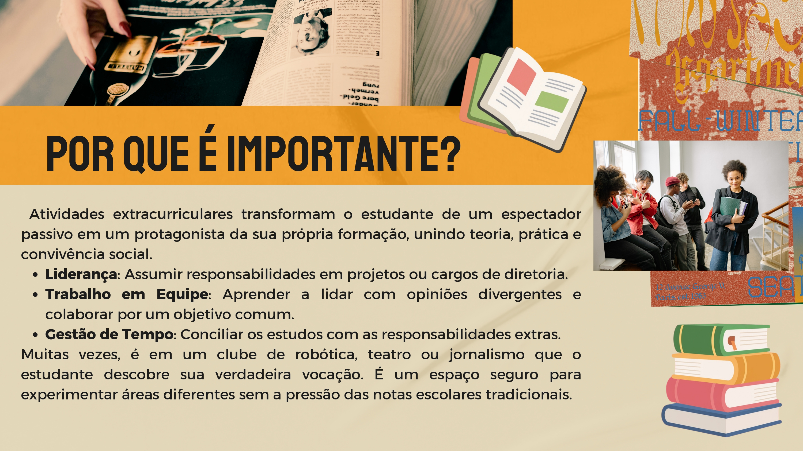
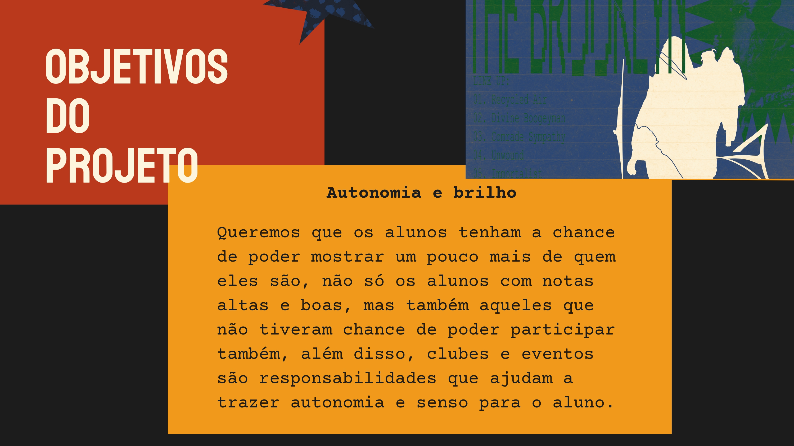
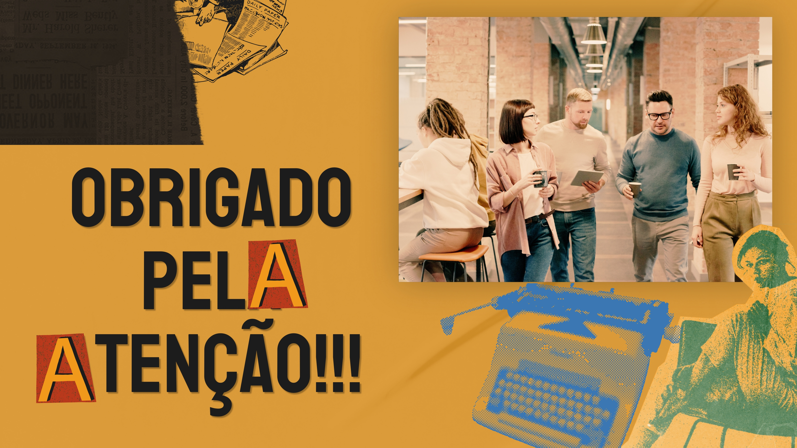

# Projeto Cérebro em ação

## Objetivo: 
O objetivo do nosso projeto é aumentar os clubes e eventos dentro da nossa escola, pois tem poucos projetos e os que tem são muito restritos a poucas pessoas. O conhecimento e habilidades sociais e técnicas que os clubes trazem não deveriam ser restritos. Por isso, nosso grupo procura criar mais grupos para dar oportunidades a mais alunos.

# Nome dos integrantes
|Ana Klara Godoy

|Maria Eduarda Betim Gomes de Moraes

|Mirella Camilloti

|Yasmin Drudi

|Isabelle Barichello

